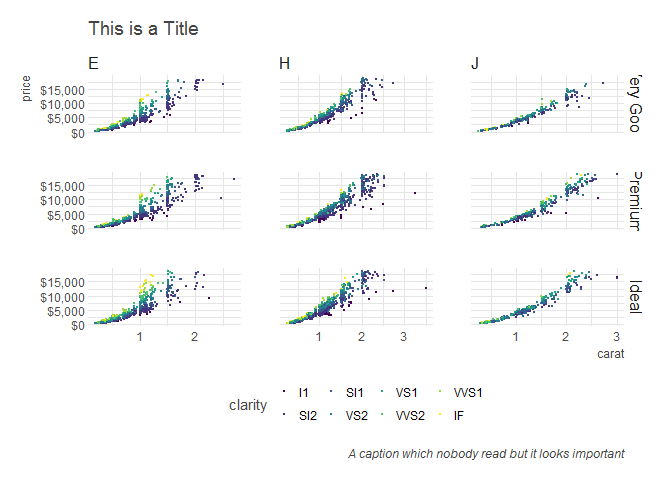

jbkmisc
================

-   [Why? What?](#why-what)
-   [Installation](#installation)
-   [Date helpers](#date-helpers)
    -   [`ym_to_date`](#ym_to_date)
    -   [`ym_diff`](#ym_diff)
    -   [`ym_format`](#ym_format)
    -   [`ym_div`](#ym_div)
-   [dplyr](#dplyr)
    -   [`countp`](#countp)
    -   [`ccount`](#ccount)
    -   [`clean`](#clean)
-   [dbplyr](#dbplyr)
    -   [`dbRemoveTableIfExists`](#dbremovetableifexists)
    -   [`compute2`](#compute2)
-   [ggplot2](#ggplot2)
    -   [`theme_jbk`](#theme_jbk)
    -   [`ggsav` and `filename_gen`](#ggsav-and-filename_gen)
-   [blog & presentations](#blog-presentations)
    -   [`spin_jekyll_post`](#spin_jekyll_post)
    -   [`blog_set_chunk`](#blog_set_chunk)
    -   [`giphy`](#giphy)
    -   [`ico`](#ico)
-   [Model helpers](#model-helpers)
    -   [`var_importance`](#var_importance)
-   [tictoc](#tictoc)
-   [shiny](#shiny)
    -   [`get_my_local_ip`](#get_my_local_ip)
-   [Report Helpers](#report-helpers)
    -   [`format_tbl`](#format_tbl)
-   [Workflow](#workflow)
    -   [`wf_create_folders`](#wf_create_folders)

<!-- [](https://travis-ci.org/jbkunst/jbkmisc)-->
Why? What?
----------

Idk:

-   Just things I need sometimes.
-   Just helpers and wrappers for my **laziness**.

Installation
------------

    source("https://install-github.me/jbkunst/jbkmisc")

Date helpers
------------

### `ym_to_date`

``` r
ym_to_date(ym = c(200902, 201912), day = 1)
```

    ## [1] "2009-02-01" "2019-12-01"

### `ym_diff`

``` r
ym_diff(ym = c(200902, 201912), ym2 = c(200901, 201712))
```

    ## [1]  1 24

### `ym_format`

``` r
ym_format(c(200902, 201912), "%B del %Y")
```

    ## [1] "febrero del 2009"   "diciembre del 2019"

### `ym_div`

``` r
year <- format(ymd(20170101) + months(0:11), "%Y%m")
year
```

    ##  [1] "201701" "201702" "201703" "201704" "201705" "201706" "201707"
    ##  [8] "201708" "201709" "201710" "201711" "201712"

``` r
ym_div(year, ng = 3)
```

    ##  [1] "201701" "201701" "201701" "201701" "201705" "201705" "201705"
    ##  [8] "201705" "201709" "201709" "201709" "201709"

``` r
ym_div(year, ng = 4)
```

    ##  [1] "201701" "201701" "201701" "201704" "201704" "201704" "201707"
    ##  [8] "201707" "201707" "201710" "201710" "201710"

dplyr
-----

### `countp`

``` r
countp(mtcars, cyl)
```

|  cyl|    n|        p|     pcum|
|----:|----:|--------:|--------:|
|    4|   11|  0.34375|  0.34375|
|    6|    7|  0.21875|  0.56250|
|    8|   14|  0.43750|  1.00000|

``` r
countp(mtcars, cyl, am)
```

|  cyl|   am|    n|        p|     pcum|
|----:|----:|----:|--------:|--------:|
|    4|    0|    3|  0.09375|  0.09375|
|    4|    1|    8|  0.25000|  0.34375|
|    6|    0|    4|  0.12500|  0.46875|
|    6|    1|    3|  0.09375|  0.56250|
|    8|    0|   12|  0.37500|  0.93750|
|    8|    1|    2|  0.06250|  1.00000|

``` r
library(dplyr)

mtcars %>%
  group_by(cyl) %>% 
  countp(am)
```

    ## # A tibble: 6 x 5
    ## # Groups:   cyl [3]
    ##     cyl    am     n     p  pcum
    ##   <dbl> <dbl> <int> <dbl> <dbl>
    ## 1    4.    0.     3 0.273 0.273
    ## 2    4.    1.     8 0.727 1.00 
    ## 3    6.    0.     4 0.571 0.571
    ## 4    6.    1.     3 0.429 1.00 
    ## 5    8.    0.    12 0.857 0.857
    ## 6    8.    1.     2 0.143 1.00

### `ccount`

``` r
ccount(iris, Species)
```

|    n|   nn|
|----:|----:|
|   50|    3|

### `clean`

``` r
head(iris, 3)
```

|  Sepal.Length|  Sepal.Width|  Petal.Length|  Petal.Width| Species |
|-------------:|------------:|-------------:|------------:|:--------|
|           5.1|          3.5|           1.4|          0.2| setosa  |
|           4.9|          3.0|           1.4|          0.2| setosa  |
|           4.7|          3.2|           1.3|          0.2| setosa  |

``` r
clean(head(iris, 3))
```

|  sepal\_length|  sepal\_width|  petal\_length|  petal\_width| species |
|--------------:|-------------:|--------------:|-------------:|:--------|
|            5.1|           3.5|            1.4|           0.2| setosa  |
|            4.9|           3.0|            1.4|           0.2| setosa  |
|            4.7|           3.2|            1.3|           0.2| setosa  |

dbplyr
------

### `dbRemoveTableIfExists`

    dbRemoveTableIfExists(con, name)

### `compute2`

    compute2(con, name)

ggplot2
-------

### `theme_jbk`

Based on `hrbrthemes::theme_ipsum`, soft gridline color, legend at top for more horizontal space.

``` r
library(ggplot2)
library(dplyr)
library(viridis)

data("diamonds")
d <- diamonds %>% 
  filter(color %in% c("E", "J", "H")) %>% 
  filter(cut %in% c("Ideal", "Premium", "Very Good")) %>% 
  sample_n(10000)
theme_set(theme_jbk())

ggplot(d, aes(carat, price)) + 
  geom_point(aes(color = clarity), size = 0.1) + 
  scale_y_continuous(labels = scales::dollar) + 
  scale_color_viridis(discrete = TRUE) + 
  facet_grid(cut ~ color, scales = "free") + 
  labs(
    title = "This is a Title",
    subtutle = "This is a longer subtitle",
    caption = "A caption which nobody read but it looks important"
  )
```



### `ggsav` and `filename_gen`

Automatic generation file names given a pattern to save without worry about names :D.

blog & presentations
--------------------

### `spin_jekyll_post`

My custom spin r file to md and move the widgets, etc.

### `blog_set_chunk`

Set opt chunk with my preferences

### `giphy`

Put a giphy image given the id.

### `ico`

``` r
ico("tv", "red")
```

    ## [1] "<span style=\"color:red\">\n  <i class=\"fa fa-tv\"></i>\n</span>"

``` r
R()
```

    ## [1] "<span style=\"color:#2066B9;font-weight:500\">R</span>"

Model helpers
-------------

### `var_importance`

``` r
rf <- randomForest::randomForest(Species ~ ., data = iris)
var_importance(rf)
```

| variable     |  importance|
|:-------------|-----------:|
| Petal.Length |   44.657509|
| Petal.Width  |   44.330833|
| Sepal.Length |    7.988387|
| Sepal.Width  |    2.319245|

``` r
rrf <- RRF::RRF(Species ~ ., data = iris)
var_importance(rrf)
```

| variable     |  importance|
|:-------------|-----------:|
| Petal.Width  |   49.115049|
| Petal.Length |   47.546045|
| Sepal.Width  |    1.337230|
| Sepal.Length |    1.308688|

``` r
library(partykit)
ct <- ctree(Species ~ ., data = iris)
ct_rules(ct)
```

|  node| rule                                                                   |
|-----:|:-----------------------------------------------------------------------|
|     2| Petal.Length &lt;= 1.9                                                 |
|     5| Petal.Length &gt; 1.9 & Petal.Width &lt;= 1.7 & Petal.Length &lt;= 4.8 |
|     6| Petal.Length &gt; 1.9 & Petal.Width &lt;= 1.7 & Petal.Length &gt; 4.8  |
|     7| Petal.Length &gt; 1.9 & Petal.Width &gt; 1.7                           |

tictoc
------

``` r
jbk_tictoc_clear()

jbk_tic(msg = "Some sleep")
```

    ## 
    ## Some sleep - starting at: 13:02:29

``` r
Sys.sleep(2)

jbk_toc()
```

    ## Some sleep - finished in: 2.01 seconds

``` r
jbk_tic(msg = "Go to sleep again!")
```

    ## 
    ## Go to sleep again! - starting at: 13:02:31

``` r
Sys.sleep(1)

jbk_toc()
```

    ## Go to sleep again! - finished in: 1.02 seconds

``` r
jbk_tictoc_log()
```

|    tic|    toc| msg                |  time\_minutes|
|------:|------:|:-------------------|--------------:|
|  12.18|  14.19| Some sleep         |         0.0335|
|  14.19|  15.21| Go to sleep again! |         0.0170|

shiny
-----

### `get_my_local_ip`

``` r
get_my_local_ip()
```

    ## [1] "172.20.218.227" "172.20.134.208"

Report Helpers
--------------

### `format_tbl`

``` r
data <- data.frame(
  p = c(NA, runif(5)),
  n = c(NA, runif(5)) * 10000
  )

data
```

|          p|         n|
|----------:|---------:|
|         NA|        NA|
|  0.7809716|  6062.246|
|  0.0036084|  7867.104|
|  0.8480068|  4680.896|
|  0.3944284|  3170.301|
|  0.9942148|  4571.795|

``` r
format_tbl(data, digits = 2)
```

| p     | n        |
|:------|:---------|
| -     | NA       |
| 78.1% | 6,062.25 |
| 0.4%  | 7,867.10 |
| 84.8% | 4,680.90 |
| 39.4% | 3,170.30 |
| 99.4% | 4,571.80 |

Workflow
--------

### `wf_create_folders`

create `data`, `code` and `output` folder.
