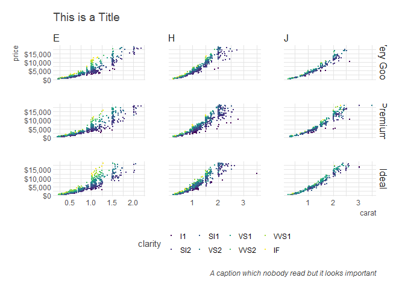

jbkmisc
================

-   [Why? What?](#why-what)
-   [Installation](#installation)
-   [date](#date)
-   [dplyrs](#dplyrs)
-   [shiny](#shiny)
-   [Workflow](#workflow)
-   [ggtheme](#ggtheme)
-   [blog & presentations](#blog-presentations)
-   [databases](#databases)

[](https://travis-ci.org/jbkunst/jbkmisc)

Why? What?
----------

Idk. Just things I need sometimes, just helpers for my **laziness**.

Installation
------------

    source("https://install-github.me/jbkunst/jbkmisc")

date
----

-   `ym_to_date`

``` r
ym_to_date(ym = c(200902, 201912), day = 1)
```

    ## [1] "2009-02-01" "2019-12-01"

-   `ym_diff`

``` r
ym_diff(ym = c(200902, 201912), ym2 = c(200901, 201712))
```

    ## [1]  1 24

-   `ym_div`

``` r
year <- format(ymd(20170101) + months(0:11), "%Y%m")
year
```

    ##  [1] "201701" "201702" "201703" "201704" "201705" "201706" "201707"
    ##  [8] "201708" "201709" "201710" "201711" "201712"

``` r
ym_div(year, ng = 3)
```

    ##  [1] "201701" "201701" "201701" "201701" "201705" "201705" "201705"
    ##  [8] "201705" "201709" "201709" "201709" "201709"

``` r
ym_div(year, ng = 4)
```

    ##  [1] "201701" "201701" "201701" "201704" "201704" "201704" "201707"
    ##  [8] "201707" "201707" "201710" "201710" "201710"

dplyrs
------

-   `countp`

``` r
countp(mtcars, cyl)
```

|  cyl|    n|        p|
|----:|----:|--------:|
|    4|   11|  0.34375|
|    6|    7|  0.21875|
|    8|   14|  0.43750|

``` r
countp(mtcars, cyl, am)
```

|  cyl|   am|    n|        p|
|----:|----:|----:|--------:|
|    4|    0|    3|  0.09375|
|    4|    1|    8|  0.25000|
|    6|    0|    4|  0.12500|
|    6|    1|    3|  0.09375|
|    8|    0|   12|  0.37500|
|    8|    1|    2|  0.06250|

-   `ccount`

``` r
ccount(iris, Species)
```

|    n|   nn|
|----:|----:|
|   50|    3|

shiny
-----

-   `get_my_local_ip`

``` r
get_my_local_ip()
```

    ## [1] "10.27.5.239"

Workflow
--------

-   `wf_create_folders`: crate data, code and output folder.

ggtheme
-------

-   `theme_jbk`:
-   Based on `hrbrthemes::theme_ipsum`
-   Soft gridline color
-   Legend at top for more horizontal space.

``` r
library(ggplot2)
library(dplyr)
library(viridis)

data("diamonds")
d <- diamonds %>% 
  filter(color %in% c("E", "J", "H")) %>% 
  filter(cut %in% c("Ideal", "Premium", "Very Good")) %>% 
  sample_n(10000)
theme_set(theme_jbk())

ggplot(d, aes(carat, price)) + 
  geom_point(aes(color = clarity), size = 0.1) + 
  geom_smooth() + 
  scale_y_continuous(labels = scales::dollar) + 
  scale_color_viridis(discrete = TRUE) + 
  facet_grid(cut ~ color, scales = "free") + 
  labs(
    title = "This is a Title",
    subtutle = "This is a longer subtitle",
    caption = "A caption which nobody read but it looks important"
  )
```



-   `ggsav` and `filename_gen`: Automatic generation file names given a pattern to save without worry about names :D.

blog & presentations
--------------------

-   `spin_jekyll_post`: My custom spin r file to md and move the widgets, etc.
-   `blog_set_chunk`: Set opt chunk with my preferences
-   `giphy`: Put a giphy image given the id.
-   `ico`:

``` r
ico("tv", "red")
```

    ## [1] "<span style=\"color:red\">\n  <i class=\"fa fa-tv\"></i>\n</span>"

``` r
R()
```

    ## [1] "<span style=\"color:#2066B9;font-weight:500\">R</span>"

databases
---------

-   `sqlQuery2`: A wrapper for `RODBC::sqlQuery` but adding `tbl_df` class.
-   `sqlquery2`: Do a sqlQuery given a channel, a table name and fields. If there are a sum, count etc, aumatically do the group by with the other fields
-   `sqlFecth2`: Do the same as `sqlFecth` but fixes the `is.POSIXct ambiguous format`
